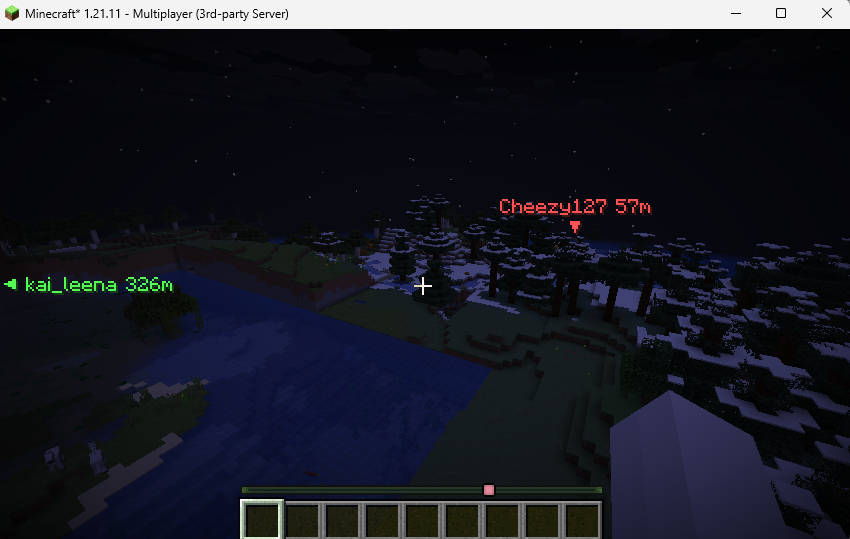
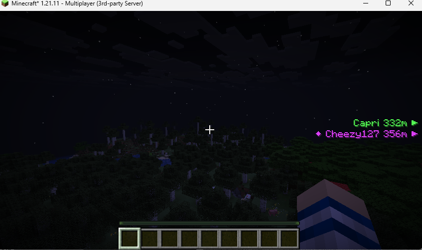
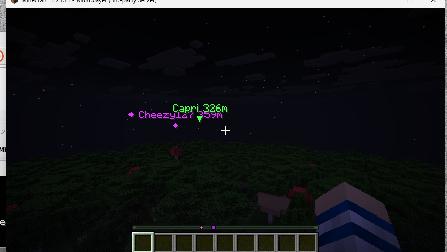
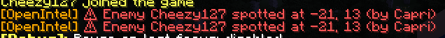

# OpenIntel

Players running the mod relay what they see (themselves + every player in their
render distance) to a small relay server. Everyone approved on that relay sees
shared markers rendered on their HUD:

- **Bright purple ◆** — focus target (marked by a Captain via `/oi focus`)
- **Green** — friends (other approved users of the mod)
- **Soft purple** — allies
- **Red** — enemies
- **Grey** — neutral / unknown

Targets on screen get a chevron + name pinned at their exact screen position.
Targets off screen are stacked by name on the left or right screen edge,
whichever side they fall off on, nearest first. Vanilla nameplates of players
in render distance are also tinted to match (mixin).

## Screenshots

An enemy marker pinned on screen, with a friend stacked on the left edge
(off-FOV, 326m away on that side):



Off-screen players stack on whichever edge they fall off, nearest first:



A focus target (`/oi focus` / `!focus`) renders bright purple with a ◆ for
everyone on the relay:



First sighting of an enemy raises a local chat + sound alert (and one
deduplicated Discord ping via the relay):



### Roles & focus targets

Users in `users.json` can have `"role": "member"` (default), `"captain"`, or
`"admin"`. Captains and admins can mark priority targets in-game:

```
/oi focus <player>    mark a focus target (bright purple ◆ for everyone)
/oi unfocus <player>  unmark
/oi focus clear       clear all focus targets
```

Focus state lives in `allegiances.json`, is pushed live to every client, and
each change is announced in both the alerts and admin Discord channels.

```
┌────────────┐   WebSocket    ┌───────────────┐   Webhook POST   ┌──────────────────┐
│ Client mod │◄──────────────►│  Relay server │─────────────────►│ Discord #alerts  │
│ (Fabric)   │  positions in/ │  (Node.js)    │  enemy pings     │ (@role ping)     │
└────────────┘  state out     │               │─────────────────►│ Discord #admin   │
      ▲                       │  users.json   │  auth/log events │ (audit log)      │
      └─ every approved user  │  allegiances  │                  └──────────────────┘
         runs one of these    └───────────────┘
```


- **Deduplication** — six people spotting the same enemy = one ping, not six.
- **Cooldowns** — an enemy standing on your snitch line doesn't spam the channel.
- **Central auth** — approved-user list lives in one place (`users.json`),
  not baked into the mod, so admins control access without rebuilding.


## Repo layout

- `mod/` — Fabric client mod (Java 25, Minecraft 26.1.2, Fabric API)
- `relay/` — Node.js relay server + webhook integration

## Quick start

### Relay server
```bash
cd relay
npm install
cp config.example.json config.json   # set port, admin token, webhook URLs
cp users.example.json users.json     # approved users + their tokens
cp allegiances.example.json allegiances.json
node server.js
```

### Client mod
```bash
cd mod
./gradlew build       # jar lands in build/libs/
```
Drop the jar in `.minecraft/mods` alongside Fabric API. On first launch the
mod writes `config/openintel.json` — set `relayUrl` (e.g.
`ws://your.server:8765`) and your personal `token`, then `/oi reconnect`
or relaunch.

### Discord setup
1. Create two webhooks (Server Settings → Integrations → Webhooks):
   one in your alerts channel, one in a private admin channel.
2. Put both URLs in `relay/config.json`.
3. For role pings, copy the role ID into `alertRoleId` and make sure the
   role is mentionable by webhooks.

## Discord terminal (optional bot)

A Discord channel can act as the relay's admin terminal. The bot runs inside
the relay process — no extra service — and is disabled until
`config.discord.botToken` is set.

### Setup

1. **Create the bot:** [discord.com/developers/applications](https://discord.com/developers/applications)
   → *New Application* (name it e.g. `OpenIntel`) → **Bot** tab → *Reset Token*
   → copy the token into `config.json` → `discord.botToken`.
2. **Enable reading messages:** still on the Bot tab, turn ON
   **Message Content Intent** under *Privileged Gateway Intents*. Without this
   the bot logs in fine but every message looks empty to it.
3. **Invite it:** **OAuth2 → URL Generator** → scope `bot` → bot permissions
   *View Channels*, *Send Messages*, *Read Message History* → open the
   generated URL and add it to your server.
4. **Pick the terminal channel:** in Discord, *User Settings → Advanced →
   Developer Mode* ON, then right-click your private intel channel →
   *Copy Channel ID* → paste into `discord.terminalChannelId`. (Leave empty to
   accept commands from any channel the bot can read — not recommended.)
5. **Map the captain role:** right-click your Captain role → *Copy Role ID* →
   `discord.captainRoleId`. Members with this role (or Discord Administrator)
   can run the mutating commands; everyone in the channel can run read-only ones.
6. Restart the relay. You should see `Discord terminal ready as OpenIntel#1234`.

```jsonc
// config.json
"discord": {
  "botToken": "MTIz...",          // Bot tab → Reset Token
  "terminalChannelId": "1513...", // right-click channel → Copy Channel ID
  "captainRoleId": "987..."       // right-click role → Copy Role ID
}
```

The bot token is a secret like everything else in `config.json` — gitignored,
never ships in the client jar. If it ever leaks, *Reset Token* in the dev
portal invalidates the old one.

### Commands

Type these in the terminal channel:

| Command | Does | Needs captain |
|---|---|---|
| `!help` | list commands | |
| `!online` | who is connected to the relay | |
| `!list` | users / allies / enemies / focus lists | |
| `!where <player>` | last known position of a tracked player | |
| `!ally add\|remove <player>` | edit ally list (pushed live to clients) | ✔ |
| `!enemy add\|remove <player>` | edit enemy list (pushed live to clients) | ✔ |
| `!focus <player>` | mark focus target (bright purple ◆ for everyone) | ✔ |
| `!unfocus <player>` / `!focus clear` | unmark / clear all | ✔ |

Positions still travel over the relay's own WebSocket — Discord rate limits
(~5 msgs/5 s per channel) make it unusable as the position transport, so the
bot is command/control only.

## Admin panel

The relay exposes a small authenticated REST API (header `x-admin-token`):

| Endpoint | Method | Purpose |
|---|---|---|
| `/allegiances` | GET / PUT | Read or replace ally/enemy lists (pushed live to all clients) |
| `/users` | GET / PUT | Read or replace approved-user list |
| `/online` | GET | Who is currently connected |

Every admin change and every connect/auth-failure is logged to the admin
webhook, so the admin Discord channel doubles as an audit trail.

## Fair-play notes

This project exists because server admins never requested an open, equal-access
version of closed intel tools. Before running it on any server, confirm
position-sharing/radar mods are legal under that server's rules — legality
varies between Civ servers.

## License

MIT — see `LICENSE`.
