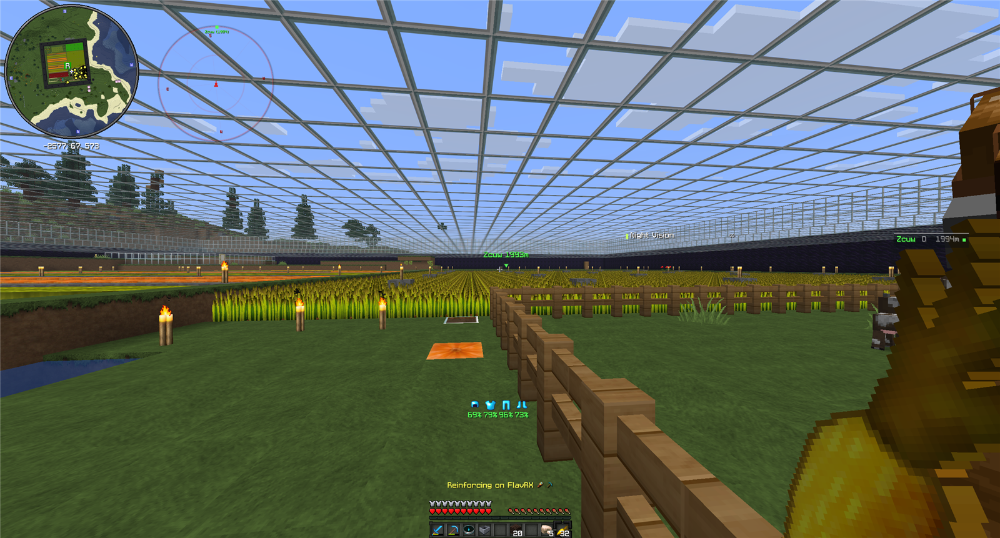
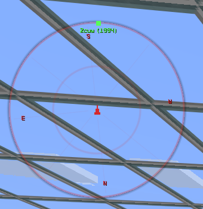
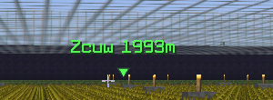
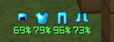
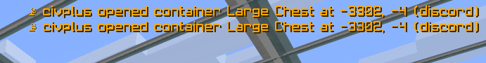
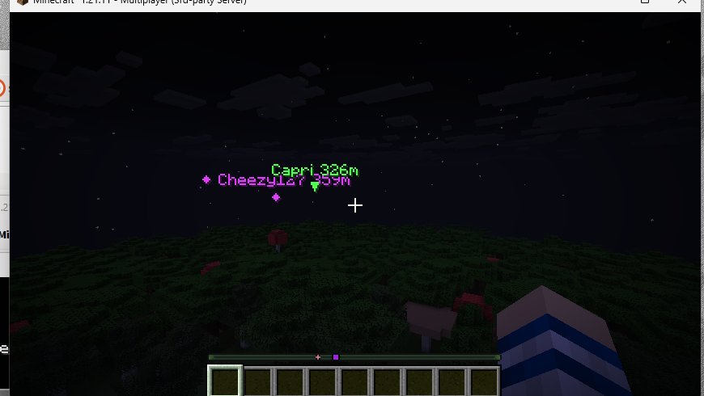
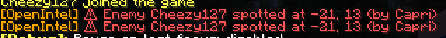
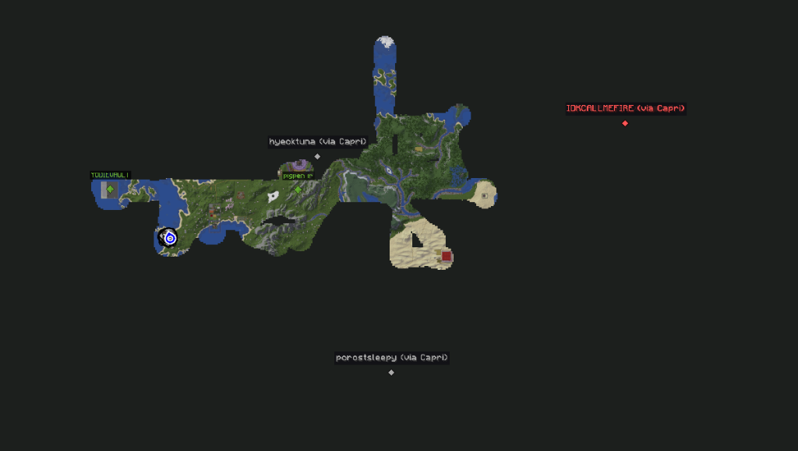

# OpenIntel

OpenIntel is a Fabric intelligence client for Minecraft 1.21.11. Approved
players continuously share themselves and everyone in their render distance
through a small relay server. The client turns that shared state into a modern,
configurable HUD without adding a minimap, waypoint database, or navigation
system.

## Features

### Shared player intelligence

- **Live player markers** use dynamic-FOV-safe projection and hand off to the
  real entity position when a player enters render distance.
- **Four-way edge stacks** place off-screen targets on the top, bottom, left,
  or right edge, sorted by distance. Each edge has an independent draggable
  anchor.
- **Allegiance colors** are consistent across markers, nameplates, radar, and
  the relay roster: green friends, soft-purple allies, red enemies, grey
  neutral players, and a bright-purple diamond for focus targets.
- **Tinted nameplates**, configurable relay opacity, optional visible-player
  markers, unlimited or capped marker range, and stale-intel fading.
- **Focus targets** can be managed in-game by Captains or through the Discord
  terminal and update live for every connected client.

### Snitch intelligence

- In-game and Discord JukeAlert messages enter the same marker pipeline.
- Normal events (`entered snitch`, login/logout) and interactions (container,
  block, sanctuary, and other coordinate-bearing actions) are parsed
  separately and refresh the correct player's location.
- One active marker is kept per player, so movement through several snitches
  updates the marker instead of leaving a ghost trail.
- Markers are dimension-aware, show snitch name, player, age, and distance,
  and have configurable color, lifetime, range, and fade.
- Semantically identical alerts are deduplicated across in-game and Discord
  sources. Approved relay users do not receive redundant snitch markers when
  their live position is already available.
- Player names in snitch alert chat lines are recolored by allegiance, so a
  hostile tripper reads red and a neutral one grey at a glance.

### Radar and shared pings

- Anti-aliased circular radar with player heads, allegiance colors, distance
  labels, compass points, configurable range rings, rotating or north-up
  orientation, and a distance-compression slider that magnifies the inner
  field linearly while compressing the outer ring — no warping near the
  center.
- Contact filtering (everyone, players not on the relay, or enemies only)
  plus toggles for dropped-item, boat, and minecart icons, which render as
  their real item sprites.
- Relay players outside render distance and shared pings pin to the radar rim,
  preserving their bearing at any distance.
- Hold the configurable ping key to open a radial wheel and broadcast a
  temporary, dimension-aware location marker.

### JourneyMap integration (optional)

- When JourneyMap is installed, snitch hits and shared pings also appear on
  its fullscreen map (the `J` key) as allegiance-tinted diamonds — enemy red,
  focus purple, neutral grey.
- Each marker shows the tripper and reporter (or ping label and sender) on a
  shadowed, backed label, and expires alongside its HUD marker.
- Strictly optional: JourneyMap is never required and nothing changes for
  clients without it. Toggle under `/oi settings` → Integrations →
  *JourneyMap fullscreen markers*. OpenIntel's own rendering is untouched.

### Movable HUD

- `/oi hud` opens a visual editor: click and drag the radar, relay roster,
  event feed, armor HUD, potion HUD, and all four marker anchors.
- Elements snap to screen edges and center guides; positions persist in
  `config/openintel.json` and can be reset from the editor.
- **Relay roster** shows connected/tracked players, allegiance, dimension,
  distance, and freshness.
- **Event feed** reports relay presence, teammate deaths, enemy sightings,
  pings, and snitch activity without blocking chat.
- **Armor HUD** shows equipped pieces with remaining durability percentages.
- **Potion HUD** shows active effect names, amplifier levels, and timers.

### Macros and configuration

- Attack, hold-attack, hold-use, and ice-road macros with safe disengagement
  when screens open, the mouse unlocks, or the selected hotbar slot changes.
- Ice-road automation supports 45-degree yaw/pitch snapping, sprint/jump
  movement, auto-eating, and optional low-hunger parking.
- `/oi settings` provides one unified screen for relay credentials, rendering,
  HUD toggles, marker/snitch behavior, presence, pings, colors, keybinds, radar,
  and macro configuration.

## Screenshots



<table>
  <tr>
    <td align="center"><br/><strong>Radar</strong></td>
    <td align="center"><br/><strong>Relay roster</strong></td>
  </tr>
  <tr>
    <td align="center"><br/><strong>Live player marker</strong></td>
    <td align="center"><br/><strong>Snitch intel</strong></td>
  </tr>
  <tr>
    <td align="center"><br/><strong>Armor HUD</strong></td>
    <td align="center"><br/><strong>Potion HUD</strong></td>
  </tr>
</table>

<p align="center">
  <br/>
  <strong>Event feed</strong> — relayed presence, alerts, and snitch interactions without chat spam
</p>

Off-screen contacts remain readable on independently positioned edge stacks:


Focus and enemy-alert behavior is shared across the relay:





Snitch hits and pings can also be mirrored onto JourneyMap's fullscreen map:

<p align="center">
  <br/>
  <strong>JourneyMap fullscreen map</strong> — allegiance-tinted snitch markers (optional integration)
</p>

## Relay roles and focus targets

Users in `users.json` have one of four backward-compatible tiers:

- `member` (default): authenticate and read relay intel.
- `operator`: member access plus focus management and admin broadcasts.
- `captain`: operator access plus allegiance management, quarantine, and session kicks.
- `admin`: captain access plus user, token, role, and disable management.

Existing `member`, `captain`, and `admin` entries remain valid. Disabled users cannot
authenticate. Quarantined users can authenticate and read, but their positions,
pings, and snitch reports are ignored. Operators and above can mark priority
targets in-game:

```
/oi focus <player>    mark a focus target (bright purple ◆ for everyone)
/oi unfocus <player>  unmark
/oi focus clear       clear all focus targets
```

Focus state lives in `allegiances.json`, is pushed live to every client, and
each change is announced in both the alerts and admin Discord channels.

## How it works

```
┌────────────┐   WebSocket    ┌───────────────┐   Webhook POST   ┌──────────────────┐
│ Client mod │◄──────────────►│  Relay server │─────────────────►│ Discord #alerts  │
│ (Fabric)   │  positions in/ │  (Node.js)    │  enemy pings     │ (@role ping)     │
└────────────┘  state out     │               │─────────────────►│ Discord #admin   │
      ▲                       │  users.json   │  auth/log events │ (audit log)      │
      └─ every approved user  │  allegiances  │                  └──────────────────┘
         runs one of these    └───────────────┘
```


- **Deduplication** — six people spotting the same enemy = one ping, not six.
- **Cooldowns** — an enemy standing on your snitch line doesn't spam the channel.
- **Central auth** — approved-user list lives in one place (`users.json`),
  not baked into the mod, so admins control access without rebuilding.
- **Server binding** — clients only connect while playing the selected
  multiplayer server, and the relay independently rejects mismatched or
  missing Minecraft-server identities during authentication.


## Repo layout

- `mod/` — Fabric client mod (Java 21, Minecraft 1.21.11, Fabric API)
- `mod/libs/` — vendored JourneyMap API jar, compile-time only (optional at runtime)
- `relay/` — Node.js relay server + webhook integration

## Quick start

### Relay server
```bash
cd relay
npm install
cp config.example.json config.json   # set port, admin token, webhook URLs
cp users.example.json users.json     # approved users + their tokens
cp allegiances.example.json allegiances.json
node server.js
```

### Client mod
```bash
cd mod
./gradlew build       # jar lands in build/libs/
```
Drop the jar in `.minecraft/mods` alongside Fabric API. On first launch the
mod writes `config/openintel.json` — set `relayUrl` (for example,
`ws://your.server:8765`), `minecraftServer` (the allowed multiplayer address),
and your personal `token`, then join that Minecraft server. These fields are
also available under `/oi settings`. If JourneyMap is installed, snitch hits
and shared pings are additionally drawn on its fullscreen map — toggleable
under `/oi settings` → Integrations.

### Discord setup
1. Create two webhooks (Server Settings → Integrations → Webhooks):
   one in your alerts channel, one in a private admin channel.
2. Put both URLs in `relay/config.json`.
3. For role pings, copy the role ID into `alertRoleId` and make sure the
   role is mentionable by webhooks.

## Discord terminal (optional bot)

One Discord bot can bridge any number of Discord servers and channels into the
relay. Configured terminal channels expose admin commands; configured snitch
channels ingest JukeAlert posts. Every source shares the same semantic snitch
deduplication, so mirrored posts across Discord servers and in-game become one
marker. The bot runs inside the relay process and is disabled until
`config.discord.botToken` is set.

### Setup

1. **Create the bot:** [discord.com/developers/applications](https://discord.com/developers/applications)
   → *New Application* (name it e.g. `OpenIntel`) → **Bot** tab → *Reset Token*
   → copy the token into `config.json` → `discord.botToken`.
2. **Enable reading messages:** still on the Bot tab, turn ON
   **Message Content Intent** under *Privileged Gateway Intents*. Without this
   the bot logs in fine but every message looks empty to it.
3. **Invite it:** **OAuth2 → URL Generator** → scope `bot` → bot permissions
   *View Channels*, *Send Messages*, *Embed Links*, *Read Message History* →
   open the generated URL and add it to every Discord server you want bridged.
   Admins who create or rotate users must allow DMs from the bot; failed DMs
   never cause tokens to be posted publicly.
4. **Pick terminal channels:** enable Discord Developer Mode, right-click each
   private command channel, copy its ID, and add it to `terminalChannelIds`.
5. **Pick snitch channels:** copy every channel ID that receives JukeAlert
   relay posts and add it to `snitchChannelIds`. Bot-authored messages are
   accepted in these channels because they are the payload.
6. **Map permission roles:** copy role IDs from every Discord server into
   `operatorRoleIds`, `captainRoleIds`, and `adminRoleIds`. Each tier includes
   the tiers below it; Discord Administrator always maps to OpenIntel admin.
7. Restart the relay. Startup reports its guild, terminal-channel, and
   snitch-channel counts.

```jsonc
// config.json
"discord": {
  "botToken": "MTIz...",
  "terminalChannelIds": ["1513...", "2846..."],
  "snitchChannelIds": ["3927...", "4018..."],
  "operatorRoleIds": ["321..."],
  "captainRoleIds": ["987...", "654..."],
  "adminRoleIds": ["765..."]
}
```

The legacy singular fields `terminalChannelId`, `snitchChannelId`,
`operatorRoleId`, `captainRoleId`, and `adminRoleId` remain supported and are
merged with their array equivalents.

The bot token is a secret like everything else in `config.json` — gitignored,
never ships in the client jar. If it ever leaks, *Reset Token* in the dev
portal invalidates the old one.

### Commands

Type these in the terminal channel:

| Command | Does | Tier |
|---|---|---|
| `!help` | list commands | member |
| `!online [page]` | paginated connected relay users | member |
| `!list [users\|allies\|enemies\|focus\|online\|all] [page]` | paginated relay lists; bare `!list` still lists all | member |
| `!where <player>` | last known position of a tracked player | member |
| `!broadcast <message>` | show a relay notice in connected clients | operator |
| `!focus <player>` / `!unfocus <player>` / `!focus clear` | manage focus targets | operator |
| `!panel` | post an interactive status/list/activity panel | operator |
| `!ally add\|remove <player>` / `!enemy add\|remove <player>` | edit allegiance lists | captain |
| `!kick <user>` | immediately close active sockets | captain |
| `!quarantine <user>` / `!unquarantine <user>` | block or restore a user's submissions | captain |
| `!user add <name> [role]` | create a user and DM the token to the invoking admin | admin |
| `!user remove\|disable\|enable <name>` | manage user access and revoke affected sessions | admin |
| `!user role <name> <member\|operator\|captain\|admin>` | change relay role | admin |
| `!user rotate-token <name>` | rotate token, revoke sessions, and DM the new token | admin |
| `!user info <name>` | safe status, token fingerprint, and session count | admin |

Positions still travel over the relay's own WebSocket — Discord rate limits
(~5 msgs/5 s per channel) make it unusable as the position transport, so the
bot is command/control only.

## Admin panel

The relay exposes a small authenticated REST API (header `x-admin-token`):

| Endpoint | Method | Purpose |
|---|---|---|
| `/allegiances` | GET / PUT | Read or replace ally/enemy lists (pushed live to all clients) |
| `/users` | GET / PUT | Read or replace approved-user list |
| `/online` | GET | Who is currently connected |

Administrative actions are appended as structured JSON lines to
`relay/audit.jsonl` and mirrored in human-readable form to the admin webhook.
Audit entries include actor/tier, action/target, guild/channel source,
before/after state, and success/reason. Tokens and other secrets are never
recorded; tokens appear only as short SHA-256 fingerprints. The audit file and
all live relay JSON configuration files are gitignored.

## Client commands and controls

| Command | Purpose |
|---|---|
| `/oi settings` | Unified relay, rendering, HUD, ping, event, color, and keybind settings |
| `/oi hud` | Visual drag-and-drop HUD editor |
| `/oi radar` | Radar size, range, orientation, entity, icon, text, and color settings |
| `/oi macros` | Attack and ice-road macro settings |
| `/oi ping` | Open the shared ping wheel without holding its keybind |
| `/oi status` | Show relay connection status |
| `/oi cut` | Admin-only: toggle outgoing relay intel to admins-only |
| `/oi cut on\|off\|status` | Explicitly set or inspect your own relay cut |
| `/oi reconnect` | Reconnect after changing relay credentials |
| `/oi url <url>` | Set the relay WebSocket URL |
| `/oi token <token>` | Set the personal relay token |
| `/oi focus <player>` | Operator-or-higher priority target |
| `/oi unfocus <player>` | Remove a priority target |

### Admin relay cut

`/oi cut` is available to authenticated relay **admins only**. It toggles
sharing of that admin's outgoing player reports, snitch alerts, and pings:

- **OFF (default):** share with all ranks.
- **ON:** share with admins only; members, operators, and captains are excluded.
- **Admin-to-admin:** unchanged even when both admins have cut enabled.
- **Incoming intel:** unchanged. Cut never disconnects the admin.

The relay enforces the restriction using the authenticated account, not a
client-supplied role or player name. Cut persists across reconnects/restarts.
Focus commands issued while cut use a separate admins-only focus list.
Public Discord enemy alerts are not generated from cut reports. `!where`
respects the caller's Discord tier. Discord admin broadcasts/administration
remain independent of the in-game account's cut switch.

An admin's cut location is also filtered from relay reports about them.
Public reports from other sources about unrelated players remain available.
Updated clients clear cached relay intel when visibility changes and receive
a fresh permitted snapshot. Previously received chat/logs, other mods' retained
copies, and locally visible Minecraft entities cannot be made unseen.
Install the updated jar on all clients for immediate cache clearing; older
clients still stop receiving restricted updates but can retain old entries
until expiry. Run `/oi reconnect` after a role promotion to refresh command access.

All controls are rebindable under the OpenIntel keybind category.

| Default key | Action |
|---|---|
| `R` | Toggle radar |
| `G` | Hold for the shared ping wheel |
| `0` | Toggle timed attack presses |
| `-` | Toggle hold attack |
| `=` | Toggle hold use |
| `Backspace` | Toggle ice-road movement |

## Fabric mod integration API (v1)

OpenIntel **1.3.0** introduces a public Java API under `dev.openintel.api`.
Use `OpenIntelApi` as the entry point; do not link against `tracker`, `net`,
`render`, or `api.internal` implementation classes. This is a client-side
Fabric API for Minecraft **1.21.11**, not the Discord/admin REST API.

### Add the dependency

Build and publish the token-neutral project to your local Maven repository:

```powershell
cd mod
.\gradlew.bat build publishToMavenLocal
```

In the consuming Fabric Loom project's `build.gradle`:

```groovy
repositories {
    mavenLocal()
}

dependencies {
    modImplementation "dev.openintel:openintel:1.3.0"
}
```

Use matching Minecraft/Yarn versions. OpenIntel is installed separately in
`mods/`; do not nest a personalized/token-bearing jar in your mod. No public
Maven repository is provisioned by this project. Alternatively, place the
neutral remapped jar in your project's `libs/` and use
`modImplementation files("libs/openintel-1.3.0.jar")`.

For a required integration, add `"openintel": ">=1.3.0"` to your mod's
`fabric.mod.json` `depends` object. Declare this entrypoint:

```json
"entrypoints": {
  "openintel:integration": ["example.ExampleOpenIntelIntegration"]
}
```

For an **optional** integration, put the version constraint in `suggests`
instead. Keep all OpenIntel imports in the integration class: OpenIntel
invokes this custom entrypoint only when installed. Do not instantiate that
class from your ordinary client entrypoint without first checking
`FabricLoader.getInstance().isModLoaded("openintel")`.

### Modules

| Accessor | Contract |
|---|---|
| `OpenIntelApi.players()` | Immutable tracked-player list and case-insensitive name lookup |
| `OpenIntelApi.snitches()` | Immutable active, dimension-bound snitch marker snapshots |
| `OpenIntelApi.pings()` | Active shared pings, lookup by ID, validated ping submission |
| `OpenIntelApi.allegiances()` | Immutable allegiance snapshot, lookup, focus/unfocus/clear requests |
| `OpenIntelApi.relay()` | Connection state, optional Minecraft server and optional reported role; no credentials |
| `OpenIntelApi.notifications()` | Add a local event-feed notification, respecting user visibility settings |
| `OpenIntelApi.events()` | Typed subscriptions with explicit unsubscribe handles |
| `OpenIntelApi.screens()` | Open the settings screen or visual HUD editor |
| `OpenIntelApi.settings()` | Read-only typed radar, marker, snitch, HUD visibility/layout, and ping settings; no secrets |
| `OpenIntelApi.hud()` | Register independent, draggable third-party HUD elements |

`OpenIntelApi.API_VERSION` is `1`; `modVersion()` reports the installed mod
version. `isReady()` indicates initialization, **not** relay authentication.
Use `relay().snapshot().authenticated()` to distinguish a connected WebSocket
from a relay session that has actually received its welcome message.
API initialization and integration entrypoints run on Fabric's `CLIENT_STARTED`
event, after Minecraft construction, not during the initial mod entrypoint.

### Read intel and subscribe

```java
package example;

import dev.openintel.api.ApiEvent;
import dev.openintel.api.OpenIntelApi;
import dev.openintel.api.OpenIntelIntegration;
import dev.openintel.api.Subscription;

public final class ExampleOpenIntelIntegration implements OpenIntelIntegration {
    private Subscription playerUpdates;

    @Override
    public void onOpenIntelInitialize() {
        playerUpdates = OpenIntelApi.events().listen(ApiEvent.PlayersChanged.class, event -> {
            for (var player : event.current()) {
                String dimension = player.position().dimension();
                double x = player.position().x();
                double z = player.position().z();
            }
        });
    }

    public void stopListening() {
        if (playerUpdates != null) playerUpdates.close();
    }
}
```

Read at any time with `OpenIntelApi.players().list()` or
`OpenIntelApi.players().find("PlayerName")`. Snapshots can safely be retained
or read on worker threads; their coordinates will not change under you.
Fetch a new snapshot to see newer intel. Before initialization, lists are
empty and the relay state is disconnected. Positions carry dimension IDs;
never plot coordinates in a different dimension or interpret unknown-world
arrivals as Overworld coordinates. Timestamps are epoch milliseconds.

Events include `Ready`, `PlayersChanged`, `SnitchesChanged`, `PingsChanged`,
`AllegiancesChanged`, `ConnectionChanged`, `SnitchArrived`,
`NotificationReceived`, `NotificationsCleared`, and `SettingsChanged`. Change events contain
previous/current immutable lists and an update, expiry, or clear cause.
`SnitchArrived` includes the action/raw alert and can describe a feed-only
alert with unknown dimension; it is not a guarantee that a marker exists.

Callbacks run on the Minecraft client thread. Keep them short; offload
expensive work using snapshots, not game objects. Subscribe before the event
you need—subscriptions do not replay history. `Subscription.close()` is
idempotent. A listener that throws a nonfatal exception is logged once and
automatically unsubscribed; register it again to retry. Other listeners
continue running. Recursive event chains are capped at 256 events per dispatch
to prevent an integration from hanging the client.

Module snapshots are independently published views, not a cross-module atomic
transaction. `SnitchArrived` represents arrivals, not globally unique incidents:
a locally forwarded message may later appear again as a relay echo. Use marker
snapshots or deduplicate arrivals if your integration needs incident counts.
`settings().snapshot()` is empty before initialization and updates by the next
client tick after a settings change. `Snapshots.Allegiance.argb()` supplies the
matching default marker color.

### Submit actions

```java
OpenIntelApi.pings().send("Regroup", 0xFF55FFFF,
        1200, 64, -500, "minecraft:overworld")
    .thenAccept(result -> {
        if (!result.accepted()) {
            System.out.println(result.status() + ": " + result.message());
        }
    });

OpenIntelApi.allegiances().requestFocus("PlayerName");
OpenIntelApi.allegiances().requestUnfocus("PlayerName");
OpenIntelApi.allegiances().requestClearFocus();
OpenIntelApi.notifications().show("Supply check complete", 0xFFAAAAAA);
OpenIntelApi.screens().openHudEditor();
```

Actions return `CompletableFuture<ActionResult>` and marshal execution onto
the client thread. **Do not block the client thread waiting on futures.**
`SUBMITTED` means sent for relay processing, not server-authorized or
acknowledged. Server-side roles, quarantine, and server binding remain in
force. Failure statuses distinguish not-ready, wrong-server, no multiplayer
session, not-authenticated, invalid arguments, session-changed, and execution
failures. `SESSION_CHANGED` rejects queued actions if the game world or relay
session changed before execution. Local notifications and screens only require
OpenIntel initialization and also work in menus/singleplayer.

The API deliberately does not expose authentication tokens, mutable config,
raw WebSockets, arbitrary protocol messages, or Discord administrative
operations. In-process mods are not a security sandbox, but integrations do
not need private internals to use these supported features. Macro input
control is not part of API v1.

### Register a draggable HUD element

Call this from your `OpenIntelIntegration.onOpenIntelInitialize()` method:

```java
var renderer = (dev.openintel.api.hud.HudRenderer) (context, size, tickDelta) -> {
    var client = net.minecraft.client.MinecraftClient.getInstance();
    context.fill(0, 0, size.width(), size.height(), 0x990C1420);
    context.drawTextWithShadow(client.textRenderer,
            "Contacts: " + OpenIntelApi.players().list().size(), 4, 4, 0xFFFFFFFF);
};

var handle = OpenIntelApi.hud().register(
        net.minecraft.util.Identifier.of("examplemod", "contacts"),
        "Example contacts", new dev.openintel.api.hud.HudSize(120, 20),
        new dev.openintel.api.hud.HudPosition(12, 180), renderer, renderer);
```

The sixth argument is an optional **preview renderer**; omit it to show only
a labeled box in the editor. Callbacks draw at local `(0, 0)`—OpenIntel
already translates and clips the context to the element bounds. Use
GUI-scaled pixels, not framebuffer pixels. Do not retain the draw context
or reset global GUI layers. Balance your own matrix/scissor operations.

The element appears automatically in `/oi hud`: drag to move, right-click
to toggle visibility, and Reset layout restores registered defaults.
Position and enabled preference are saved by ID in `config/openintel.json`.
Resizing clamps the displayed element without destroying its saved position.
Use your own mod namespace; duplicate IDs and the `openintel` namespace are
rejected. `handle.close()` unregisters without deleting the saved layout.

`elements()` and `element(id)` return immutable descriptors; `getPosition`,
`setPosition`, `isEnabled`, `setEnabled`, `reset`, and `saveLayout` provide
programmatic control. Registration, closing handles, and reads are
thread-safe. **HUD setters/reset/save require the client thread** (use
`MinecraftClient.execute`); unlike shared actions they do not return futures.
Off-thread descriptor reads reflect the most recently synchronized config.
A failing renderer is logged once and suppressed until reset/re-registration.
Disabled elements can still provide previews.

### Compatibility and verification

Only documented public interfaces are the API contract. Breaking contract
changes require a new API version; additive modules can be introduced
without changing v1. This does not promise binary compatibility across
Minecraft versions. Build output includes the remapped mod and source jar.

`gradlew build` runs the standalone snitch-dimension and API contract checks
without adding a test-library dependency. Tests cover immutable payloads,
pre-initialization reads/actions, subscription cleanup, and listener failure
isolation. Actual in-game rendering still requires a runtime smoke test.

## Fair-play notes

This project exists because server admins never requested an open, equal-access
version of closed intel tools. Before running it on any server, confirm
position-sharing/radar mods are legal under that server's rules — legality
varies between Civ servers.

## License

MIT — see `LICENSE`.
